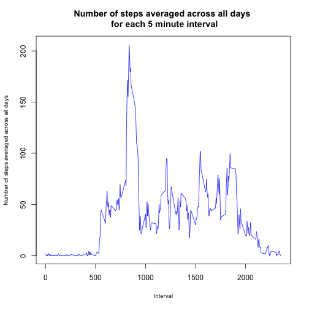

## Loading of packages

```r
library(lubridate)
library(plyr)
library(dplyr)
library(ggplot2)
library(tidyr)
library(lattice)
library(knitr)
```
## Loading and preprocessing the data
### Step 1: Loading and preprocessing the data
### Loading and preprocessing the data

#### 1.1. Load the data (i.e. read.csv() )
###### check the data

```r
readLines("activity.csv", 4)
```

```
## [1] "\"steps\",\"date\",\"interval\"" "NA,\"2012-10-01\",0"            
## [3] "NA,\"2012-10-01\",5"             "NA,\"2012-10-01\",10"
```
###### read the data as csv

```r
data <- read.csv("activity.csv", header = TRUE)
head(data)
```

```
##   steps       date interval
## 1    NA 2012-10-01        0
## 2    NA 2012-10-01        5
## 3    NA 2012-10-01       10
## 4    NA 2012-10-01       15
## 5    NA 2012-10-01       20
## 6    NA 2012-10-01       25
```
###### check the class of the data

```r
class_data <- lapply(data, class)
class_data
```

```
## $steps
## [1] "integer"
## 
## $date
## [1] "factor"
## 
## $interval
## [1] "integer"
```


## What is mean total number of steps taken per day?
### Step 2: Calculation of the mean total number of steps taken per day

#### 2.1 Calculation of sum of the steps per day ignoring the NA values
#### The value assigned to the NA elements (missing values) is zero in this implementation
#### This is accomplished through the na.rm = TRUE argument


```r
total_steps_per_day_data <- data %>% 
        group_by(date) %>% 
        summarise(steps_per_day = sum(steps, na.rm = TRUE)) %>%
        ungroup


head(total_steps_per_day_data)
```

```
## Source: local data frame [6 x 2]
## 
##         date steps_per_day
## 1 2012-10-01             0
## 2 2012-10-02           126
## 3 2012-10-03         11352
## 4 2012-10-04         12116
## 5 2012-10-05         13294
## 6 2012-10-06         15420
```

```r
str(total_steps_per_day_data)
```

```
## Classes 'tbl_df', 'tbl' and 'data.frame':	61 obs. of  2 variables:
##  $ date         : Factor w/ 61 levels "2012-10-01","2012-10-02",..: 1 2 3 4 5 6 7 8 9 10 ...
##  $ steps_per_day: int  0 126 11352 12116 13294 15420 11015 0 12811 9900 ...
##  - attr(*, "drop")= logi TRUE
```

```r
head(total_steps_per_day_data$steps_per_day)
```

```
## [1]     0   126 11352 12116 13294 15420
```

#### 2.2 Creation of a histogram of the number of steps


```r
hist(total_steps_per_day_data$steps_per_day, breaks = 8, xlab = "Total Steps per Day", col = "red", main = "Total Steps per Day (Frequency)", ylim = c(0,35))
```

 

#### 2.3 Calculation of the mean and median of the total steps per day

## 

```r
mean_median_and_other_values <- summary(total_steps_per_day_data$steps_per_day)
print(mean_median_and_other_values)
```

```
##    Min. 1st Qu.  Median    Mean 3rd Qu.    Max. 
##       0    6778   10400    9354   12810   21190
```

## What is the average daily activity pattern?
### Step 3: Identification of the average daily activity pattern

#### 3.1 Make a time series plot (i.e. type = "l" ) of the 5-minute interval 
#### (x-axis) and the average number of steps taken, averaged across all days (y-axis)

##### 3.1.1 Calculation of the average number of steps taken, averaged across all days for each 
##### 5-minute interval.
##### The value assigned to the NA elements (missing values) is zero in this implementation
##### This is accomplished through the na.rm = TRUE argument


```r
average_steps_per_interval_data <- data %>% 
        group_by(interval) %>% 
        summarise(steps_per_interval = mean(steps, na.rm = TRUE)) %>%
        ungroup
head(average_steps_per_interval_data)
```

```
## Source: local data frame [6 x 2]
## 
##   interval steps_per_interval
## 1        0          1.7169811
## 2        5          0.3396226
## 3       10          0.1320755
## 4       15          0.1509434
## 5       20          0.0754717
## 6       25          2.0943396
```

```r
tail(average_steps_per_interval_data)
```

```
## Source: local data frame [6 x 2]
## 
##   interval steps_per_interval
## 1     2330          2.6037736
## 2     2335          4.6981132
## 3     2340          3.3018868
## 4     2345          0.6415094
## 5     2350          0.2264151
## 6     2355          1.0754717
```

```r
str(average_steps_per_interval_data)
```

```
## Classes 'tbl_df', 'tbl' and 'data.frame':	288 obs. of  2 variables:
##  $ interval          : int  0 5 10 15 20 25 30 35 40 45 ...
##  $ steps_per_interval: num  1.717 0.3396 0.1321 0.1509 0.0755 ...
##  - attr(*, "drop")= logi TRUE
```

```r
head(average_steps_per_interval_data$steps_per_interval)
```

```
## [1] 1.7169811 0.3396226 0.1320755 0.1509434 0.0754717 2.0943396
```

##### 3.1.2 Creation of the plot of the 5-minute interval (x-axis) 
##### and the average number of steps taken, averaged across all days (y-axis)


```r
par(cex.lab = 0.8)
plot(average_steps_per_interval_data$interval, average_steps_per_interval_data$steps_per_interval, ylab = "Number of steps averaged across all days", xlab = "Interval", type = "l", pch = 3, lwd =1, main = "Number of steps averaged across all days \n for each 5 minute interval", col = "blue")
```

 

#### 3.2 Identification of the 5-minute interval, on average across all the days in the dataset, 
#### that contains the maximum number of steps


```r
interval_with_max_n_step_index <- which.max(average_steps_per_interval_data$steps_per_interval)
interval_with_max_n_step_index
```

```
## [1] 104
```

#### Interval with the maximum number of steps


```r
interval_with_max_n_steps <- average_steps_per_interval_data$interval[interval_with_max_n_step_index]
interval_with_max_n_steps
```

```
## [1] 835
```

#### check value and surrounding values


```r
average_steps_per_interval_data[100:106,]
```

```
## Source: local data frame [7 x 2]
## 
##   interval steps_per_interval
## 1      815           157.5283
## 2      820           171.1509
## 3      825           155.3962
## 4      830           177.3019
## 5      835           206.1698
## 6      840           195.9245
## 7      845           179.5660
```

## Imputing missing values
### Step 4: Inputting the missing  values

#### 4.1 Calculation and report of the total number of missing values in the dataset 
#### (i.e., the total number of rows with NAs)


```r
total_na_values <- sum(is.na(data$steps))

print(total_na_values)
```

```
## [1] 2304
```

#### 4.2 Filling of all the missing values in the dataset. 
#### It is possible to use the mean/median for that day, or the mean for that 
#### 5-minute interval, etc. to accomplish this objective.
#### In this implementation, the mean number of steps for each interval that was 
#### calculated without the NA values will be used to fill in the missing values
#### for the interval.


#### 4.3 Creation of a new dataset that is equal to the original dataset, but with the missing data #### filled in
##### 4.3.1 Add to the data a column with the mean for a specific interval


```r
data_with_average_steps_per_interval_data <- data %>% 
        group_by(interval) %>% 
        mutate(average_steps_per_interval = mean(steps, na.rm = TRUE)) %>%
        ungroup
head(data_with_average_steps_per_interval_data)
```

```
## Source: local data frame [6 x 4]
## 
##   steps       date interval average_steps_per_interval
## 1    NA 2012-10-01        0                  1.7169811
## 2    NA 2012-10-01        5                  0.3396226
## 3    NA 2012-10-01       10                  0.1320755
## 4    NA 2012-10-01       15                  0.1509434
## 5    NA 2012-10-01       20                  0.0754717
## 6    NA 2012-10-01       25                  2.0943396
```

```r
tail(data_with_average_steps_per_interval_data)
```

```
## Source: local data frame [6 x 4]
## 
##   steps       date interval average_steps_per_interval
## 1    NA 2012-11-30     2330                  2.6037736
## 2    NA 2012-11-30     2335                  4.6981132
## 3    NA 2012-11-30     2340                  3.3018868
## 4    NA 2012-11-30     2345                  0.6415094
## 5    NA 2012-11-30     2350                  0.2264151
## 6    NA 2012-11-30     2355                  1.0754717
```

```r
str(data_with_average_steps_per_interval_data)
```

```
## Classes 'tbl_df', 'tbl' and 'data.frame':	17568 obs. of  4 variables:
##  $ steps                     : int  NA NA NA NA NA NA NA NA NA NA ...
##  $ date                      : Factor w/ 61 levels "2012-10-01","2012-10-02",..: 1 1 1 1 1 1 1 1 1 1 ...
##  $ interval                  : int  0 5 10 15 20 25 30 35 40 45 ...
##  $ average_steps_per_interval: num  1.717 0.3396 0.1321 0.1509 0.0755 ...
```

##### 4.3.2 Selection of the rows with a steps value == NA


```r
na_values_selector <- is.na(data_with_average_steps_per_interval_data$steps)
head(na_values_selector)
```

```
## [1] TRUE TRUE TRUE TRUE TRUE TRUE
```

##### 4.3.3 For these rows set the values in the steps column so that they are equal 
##### to the values in the column average_steps_per_interval


```r
data_with_average_steps_per_interval_data$steps[na_values_selector] <- data_with_average_steps_per_interval_data$average_steps_per_interval[na_values_selector]

head(data_with_average_steps_per_interval_data$steps[na_values_selector])
```

```
## [1] 1.7169811 0.3396226 0.1320755 0.1509434 0.0754717 2.0943396
```

##### 4.3.4 Verification to check if there are any NA values left 


```r
total_na_values_after_change <- sum(is.na(data_with_average_steps_per_interval_data$steps))

print(total_na_values_after_change)
```

```
## [1] 0
```

##### 4.3.5 Assignment of a new name to data


```r
data_without_na <- data_with_average_steps_per_interval_data
head(data_without_na)
```

```
## Source: local data frame [6 x 4]
## 
##       steps       date interval average_steps_per_interval
## 1 1.7169811 2012-10-01        0                  1.7169811
## 2 0.3396226 2012-10-01        5                  0.3396226
## 3 0.1320755 2012-10-01       10                  0.1320755
## 4 0.1509434 2012-10-01       15                  0.1509434
## 5 0.0754717 2012-10-01       20                  0.0754717
## 6 2.0943396 2012-10-01       25                  2.0943396
```

#### 4.4 Creation of a histogram of the total number of steps taken each day 
#### and calculation and report of the mean and median total number of steps 
#### taken per day

##### 4.4.1 Calculation of sum of the steps per day for data without NA values
##### (i.e., for data in which the NA values have been changed into calcualted
##### values)


```r
total_steps_per_day_data_without_na <- data_without_na %>% 
        group_by(date) %>% 
        summarise(steps_per_day = sum(steps, na.rm = TRUE)) %>%
        ungroup
head(total_steps_per_day_data_without_na)
```

```
## Source: local data frame [6 x 2]
## 
##         date steps_per_day
## 1 2012-10-01      10766.19
## 2 2012-10-02        126.00
## 3 2012-10-03      11352.00
## 4 2012-10-04      12116.00
## 5 2012-10-05      13294.00
## 6 2012-10-06      15420.00
```

```r
str(total_steps_per_day_data_without_na)
```

```
## Classes 'tbl_df', 'tbl' and 'data.frame':	61 obs. of  2 variables:
##  $ date         : Factor w/ 61 levels "2012-10-01","2012-10-02",..: 1 2 3 4 5 6 7 8 9 10 ...
##  $ steps_per_day: num  10766 126 11352 12116 13294 ...
##  - attr(*, "drop")= logi TRUE
```

```r
head(total_steps_per_day_data_without_na$steps_per_day)
```

```
## [1] 10766.19   126.00 11352.00 12116.00 13294.00 15420.00
```

##### 4.4.2 Creation of a histogram of the number of steps


```r
hist(total_steps_per_day_data_without_na$steps_per_day, breaks = 8, xlab = "Total Steps per Day", col = "red", main = "Total Steps per Day")
```

 

##### 4.4.3 Calculation of the mean and median of the total steps per day

## 

```r
mean_median_and_other_values_no_na <- summary(total_steps_per_day_data_without_na$steps_per_day)
print(mean_median_and_other_values_no_na)
```

```
##    Min. 1st Qu.  Median    Mean 3rd Qu.    Max. 
##      41    9819   10770   10770   12810   21190
```


###### 4.4.3.1 The values are more centered around the median after the elimination of the NA values,
###### and the mean is at a higher value. Both the median and the mean have increased.


##### 4.4.4 Analysis of how these values differ from the estimates in the first part of the  
##### assignment.
##### Analysis of the impact of imputing missing data on the estimates of the total daily number of ##### steps.

###### 4.4.4.1 Creation of a dataset with the data with NA values and without NA values

###### 4.4.4.1.1 Renaming of the column for the data without NA


```r
total_steps_per_day_data_without_na <- transmute(total_steps_per_day_data_without_na, date = date, steps_per_day_without_na = steps_per_day)
total_steps_per_day_data_without_na
```

```
## Source: local data frame [61 x 2]
## 
##          date steps_per_day_without_na
## 1  2012-10-01                 10766.19
## 2  2012-10-02                   126.00
## 3  2012-10-03                 11352.00
## 4  2012-10-04                 12116.00
## 5  2012-10-05                 13294.00
## 6  2012-10-06                 15420.00
## 7  2012-10-07                 11015.00
## 8  2012-10-08                 10766.19
## 9  2012-10-09                 12811.00
## 10 2012-10-10                  9900.00
## ..        ...                      ...
```

###### 4.4.4.1.2 Creation of a dataset for the comparison


```r
dim(total_steps_per_day_data)
```

```
## [1] 61  2
```

```r
dim(total_steps_per_day_data_without_na)
```

```
## [1] 61  2
```

```r
comparison_total_steps_per_day_data <- left_join(total_steps_per_day_data, total_steps_per_day_data_without_na, by ="date")
head(comparison_total_steps_per_day_data)
```

```
## Source: local data frame [6 x 3]
## 
##         date steps_per_day steps_per_day_without_na
## 1 2012-10-01             0                 10766.19
## 2 2012-10-02           126                   126.00
## 3 2012-10-03         11352                 11352.00
## 4 2012-10-04         12116                 12116.00
## 5 2012-10-05         13294                 13294.00
## 6 2012-10-06         15420                 15420.00
```

###### 4.4.4.1.2 Modification of the dataset so there is a factor for the presence of NA


```r
comparison_total_steps_per_day_with_factor_data <- gather(comparison_total_steps_per_day_data, na_presence, steps, -date)
head(comparison_total_steps_per_day_with_factor_data)
```

```
## Source: local data frame [6 x 3]
## 
##         date   na_presence steps
## 1 2012-10-01 steps_per_day     0
## 2 2012-10-02 steps_per_day   126
## 3 2012-10-03 steps_per_day 11352
## 4 2012-10-04 steps_per_day 12116
## 5 2012-10-05 steps_per_day 13294
## 6 2012-10-06 steps_per_day 15420
```

```r
str(comparison_total_steps_per_day_with_factor_data)
```

```
## Classes 'tbl_df', 'tbl' and 'data.frame':	122 obs. of  3 variables:
##  $ date       : Factor w/ 61 levels "2012-10-01","2012-10-02",..: 1 2 3 4 5 6 7 8 9 10 ...
##  $ na_presence: Factor w/ 2 levels "steps_per_day",..: 1 1 1 1 1 1 1 1 1 1 ...
##  $ steps      : num  0 126 11352 12116 13294 ...
```


###### 4.4.4.1.3 Creation of a plot to show the difference between data with NA values and data without ###### NA values
##


```r
g <- ggplot(comparison_total_steps_per_day_with_factor_data, aes(steps, color = na_presence))
q <- g + geom_histogram(binwidth = 3000) + facet_grid(na_presence ~ .) + labs(title = "Total number of steps \ntaken each day (count)")
print(q)
```

 

###### 4.4.4.1.4 Comparison of two boxplots with NA values and without NA values


```r
par(mfrow = c(1,1))
boxplot(steps ~ na_presence, data = comparison_total_steps_per_day_with_factor_data, main="Comparison of Steps per Day between data that \nincludes NA values and data that does not")
```

 
###### 4.4.4.1.5 Comparison of median and mean values between data with NA values and data without NA ###### values

###### Results for the data with NA values
##


```r
mean_median_and_other_values <- summary(total_steps_per_day_data$steps_per_day)
print(mean_median_and_other_values)
```

```
##    Min. 1st Qu.  Median    Mean 3rd Qu.    Max. 
##       0    6778   10400    9354   12810   21190
```

###### Results for the data without NA values
## 


```r
mean_median_and_other_values_no_na <- summary(total_steps_per_day_data_without_na$steps_per_day)
print(mean_median_and_other_values_no_na)
```

```
##    Min. 1st Qu.  Median    Mean 3rd Qu.    Max. 
##      41    9819   10770   10770   12810   21190
```

## Are there differences in activity patterns between weekdays and weekends?
### Step 5: Find if there are differences in activity patterns between weekdays and weekends

###### For this step, the data without NA will be used.


```r
head(data_without_na)
```

```
## Source: local data frame [6 x 4]
## 
##       steps       date interval average_steps_per_interval
## 1 1.7169811 2012-10-01        0                  1.7169811
## 2 0.3396226 2012-10-01        5                  0.3396226
## 3 0.1320755 2012-10-01       10                  0.1320755
## 4 0.1509434 2012-10-01       15                  0.1509434
## 5 0.0754717 2012-10-01       20                  0.0754717
## 6 2.0943396 2012-10-01       25                  2.0943396
```

```r
str(data_without_na)
```

```
## Classes 'tbl_df', 'tbl' and 'data.frame':	17568 obs. of  4 variables:
##  $ steps                     : num  1.717 0.3396 0.1321 0.1509 0.0755 ...
##  $ date                      : Factor w/ 61 levels "2012-10-01","2012-10-02",..: 1 1 1 1 1 1 1 1 1 1 ...
##  $ interval                  : int  0 5 10 15 20 25 30 35 40 45 ...
##  $ average_steps_per_interval: num  1.717 0.3396 0.1321 0.1509 0.0755 ...
```

#### 5.1 Creation of a new factor variable in the dataset with two levels, “weekday” and “weekend” 
#### indicating whether a given date is a weekday or weekend day
  

##### 5.1.1 Modification of a date to change it into a date type


```r
data_without_na$date <- ymd(data_without_na$date)
str(data_without_na)
```

```
## Classes 'tbl_df', 'tbl' and 'data.frame':	17568 obs. of  4 variables:
##  $ steps                     : num  1.717 0.3396 0.1321 0.1509 0.0755 ...
##  $ date                      : POSIXct, format: "2012-10-01" "2012-10-01" ...
##  $ interval                  : int  0 5 10 15 20 25 30 35 40 45 ...
##  $ average_steps_per_interval: num  1.717 0.3396 0.1321 0.1509 0.0755 ...
```

##### 5.1.2 Addition of a column with weekdays


```r
data_without_na_with_weekdays <- mutate(data_without_na, day_of_the_week = weekdays(date))
head(data_without_na_with_weekdays)
```

```
## Source: local data frame [6 x 5]
## 
##       steps       date interval average_steps_per_interval day_of_the_week
## 1 1.7169811 2012-10-01        0                  1.7169811          Monday
## 2 0.3396226 2012-10-01        5                  0.3396226          Monday
## 3 0.1320755 2012-10-01       10                  0.1320755          Monday
## 4 0.1509434 2012-10-01       15                  0.1509434          Monday
## 5 0.0754717 2012-10-01       20                  0.0754717          Monday
## 6 2.0943396 2012-10-01       25                  2.0943396          Monday
```

```r
str(data_without_na_with_weekdays)
```

```
## Classes 'tbl_df', 'tbl' and 'data.frame':	17568 obs. of  5 variables:
##  $ steps                     : num  1.717 0.3396 0.1321 0.1509 0.0755 ...
##  $ date                      : POSIXct, format: "2012-10-01" "2012-10-01" ...
##  $ interval                  : int  0 5 10 15 20 25 30 35 40 45 ...
##  $ average_steps_per_interval: num  1.717 0.3396 0.1321 0.1509 0.0755 ...
##  $ day_of_the_week           : chr  "Monday" "Monday" "Monday" "Monday" ...
```

##### 5.1.3 Creation of another column with a factor

###### 5.1.3.1 Selection of the weekdays


```r
weekday_or_weekend <- ifelse(data_without_na_with_weekdays$day_of_the_week %in% c("Saturday", "Sunday"), "weekend", "weekday")
head(weekday_or_weekend)
```

```
## [1] "weekday" "weekday" "weekday" "weekday" "weekday" "weekday"
```

```r
length(weekday_or_weekend)
```

```
## [1] 17568
```

```r
str(weekday_or_weekend)
```

```
##  chr [1:17568] "weekday" "weekday" "weekday" "weekday" ...
```

###### 5.1.3.2 Addition of a column with weekday_or_weekend


```r
data_without_na_with_weekdays_and_weekday_weekend_factor <- mutate(data_without_na_with_weekdays, weekday_or_weekend = weekday_or_weekend)
head(data_without_na_with_weekdays_and_weekday_weekend_factor)
```

```
## Source: local data frame [6 x 6]
## 
##       steps       date interval average_steps_per_interval day_of_the_week
## 1 1.7169811 2012-10-01        0                  1.7169811          Monday
## 2 0.3396226 2012-10-01        5                  0.3396226          Monday
## 3 0.1320755 2012-10-01       10                  0.1320755          Monday
## 4 0.1509434 2012-10-01       15                  0.1509434          Monday
## 5 0.0754717 2012-10-01       20                  0.0754717          Monday
## 6 2.0943396 2012-10-01       25                  2.0943396          Monday
## Variables not shown: weekday_or_weekend (chr)
```

```r
tail(data_without_na_with_weekdays_and_weekday_weekend_factor)
```

```
## Source: local data frame [6 x 6]
## 
##       steps       date interval average_steps_per_interval day_of_the_week
## 1 2.6037736 2012-11-30     2330                  2.6037736          Friday
## 2 4.6981132 2012-11-30     2335                  4.6981132          Friday
## 3 3.3018868 2012-11-30     2340                  3.3018868          Friday
## 4 0.6415094 2012-11-30     2345                  0.6415094          Friday
## 5 0.2264151 2012-11-30     2350                  0.2264151          Friday
## 6 1.0754717 2012-11-30     2355                  1.0754717          Friday
## Variables not shown: weekday_or_weekend (chr)
```

```r
str(data_without_na_with_weekdays_and_weekday_weekend_factor)
```

```
## Classes 'tbl_df', 'tbl' and 'data.frame':	17568 obs. of  6 variables:
##  $ steps                     : num  1.717 0.3396 0.1321 0.1509 0.0755 ...
##  $ date                      : POSIXct, format: "2012-10-01" "2012-10-01" ...
##  $ interval                  : int  0 5 10 15 20 25 30 35 40 45 ...
##  $ average_steps_per_interval: num  1.717 0.3396 0.1321 0.1509 0.0755 ...
##  $ day_of_the_week           : chr  "Monday" "Monday" "Monday" "Monday" ...
##  $ weekday_or_weekend        : chr  "weekday" "weekday" "weekday" "weekday" ...
```

###### 5.1.3.3 Modification of weekday_or_weekend to change it into a factor


```r
data_without_na_with_weekdays_and_weekday_weekend_factor$weekday_or_weekend <- as.factor(data_without_na_with_weekdays_and_weekday_weekend_factor$weekday_or_weekend)

str(data_without_na_with_weekdays_and_weekday_weekend_factor)
```

```
## Classes 'tbl_df', 'tbl' and 'data.frame':	17568 obs. of  6 variables:
##  $ steps                     : num  1.717 0.3396 0.1321 0.1509 0.0755 ...
##  $ date                      : POSIXct, format: "2012-10-01" "2012-10-01" ...
##  $ interval                  : int  0 5 10 15 20 25 30 35 40 45 ...
##  $ average_steps_per_interval: num  1.717 0.3396 0.1321 0.1509 0.0755 ...
##  $ day_of_the_week           : chr  "Monday" "Monday" "Monday" "Monday" ...
##  $ weekday_or_weekend        : Factor w/ 2 levels "weekday","weekend": 1 1 1 1 1 1 1 1 1 1 ...
```

```r
head(data_without_na_with_weekdays_and_weekday_weekend_factor)
```

```
## Source: local data frame [6 x 6]
## 
##       steps       date interval average_steps_per_interval day_of_the_week
## 1 1.7169811 2012-10-01        0                  1.7169811          Monday
## 2 0.3396226 2012-10-01        5                  0.3396226          Monday
## 3 0.1320755 2012-10-01       10                  0.1320755          Monday
## 4 0.1509434 2012-10-01       15                  0.1509434          Monday
## 5 0.0754717 2012-10-01       20                  0.0754717          Monday
## 6 2.0943396 2012-10-01       25                  2.0943396          Monday
## Variables not shown: weekday_or_weekend (fctr)
```

```r
tail(data_without_na_with_weekdays_and_weekday_weekend_factor)
```

```
## Source: local data frame [6 x 6]
## 
##       steps       date interval average_steps_per_interval day_of_the_week
## 1 2.6037736 2012-11-30     2330                  2.6037736          Friday
## 2 4.6981132 2012-11-30     2335                  4.6981132          Friday
## 3 3.3018868 2012-11-30     2340                  3.3018868          Friday
## 4 0.6415094 2012-11-30     2345                  0.6415094          Friday
## 5 0.2264151 2012-11-30     2350                  0.2264151          Friday
## 6 1.0754717 2012-11-30     2355                  1.0754717          Friday
## Variables not shown: weekday_or_weekend (fctr)
```

#### 5.2 Creation of a panel plot containing a time series plot (i.e. type = "l" ) of the 5-minute 
#### interval (x-axis) and the average number of steps taken, averaged across all weekday days or 
#### weekend days (y-axis)

#####  5.2.1 Calculation of the average number of steps taken, averaged across all days for each 5-minute interval


```r
average_steps_per_interval_data <- data_without_na_with_weekdays_and_weekday_weekend_factor %>% 
        group_by(interval, weekday_or_weekend) %>% 
        summarise(steps_per_interval = mean(steps, na.rm = TRUE)) %>%
        ungroup
head(average_steps_per_interval_data)
```

```
## Source: local data frame [6 x 3]
## 
##   interval weekday_or_weekend steps_per_interval
## 1        0            weekday         2.25115304
## 2        0            weekend         0.21462264
## 3        5            weekday         0.44528302
## 4        5            weekend         0.04245283
## 5       10            weekday         0.17316562
## 6       10            weekend         0.01650943
```

```r
tail(average_steps_per_interval_data)
```

```
## Source: local data frame [6 x 3]
## 
##   interval weekday_or_weekend steps_per_interval
## 1     2345            weekday         0.26331237
## 2     2345            weekend         1.70518868
## 3     2350            weekday         0.29685535
## 4     2350            weekend         0.02830189
## 5     2355            weekday         1.41006289
## 6     2355            weekend         0.13443396
```

```r
str(average_steps_per_interval_data)
```

```
## Classes 'tbl_df', 'tbl' and 'data.frame':	576 obs. of  3 variables:
##  $ interval          : int  0 0 5 5 10 10 15 15 20 20 ...
##  $ weekday_or_weekend: Factor w/ 2 levels "weekday","weekend": 1 2 1 2 1 2 1 2 1 2 ...
##  $ steps_per_interval: num  2.2512 0.2146 0.4453 0.0425 0.1732 ...
```

```r
head(average_steps_per_interval_data$steps_per_interval)
```

```
## [1] 2.25115304 0.21462264 0.44528302 0.04245283 0.17316562 0.01650943
```

```r
tail(average_steps_per_interval_data$steps_per_interval)
```

```
## [1] 0.26331237 1.70518868 0.29685535 0.02830189 1.41006289 0.13443396
```

```r
str(average_steps_per_interval_data$steps_per_interval)
```

```
##  num [1:576] 2.2512 0.2146 0.4453 0.0425 0.1732 ...
```

##### 5.2.2 Creation of the plot of the 5-minute interval (x-axis) 
##### and the average number of steps taken, averaged across all days (y-axis)
## 


```r
xyplot(steps_per_interval ~ interval | weekday_or_weekend,  data = average_steps_per_interval_data, layout = c(1,2), type = "l", main = "Average Number of Steps Averaged Across All Days", xlab = "Interval", ylab = "Steps per Interval")
```

 
